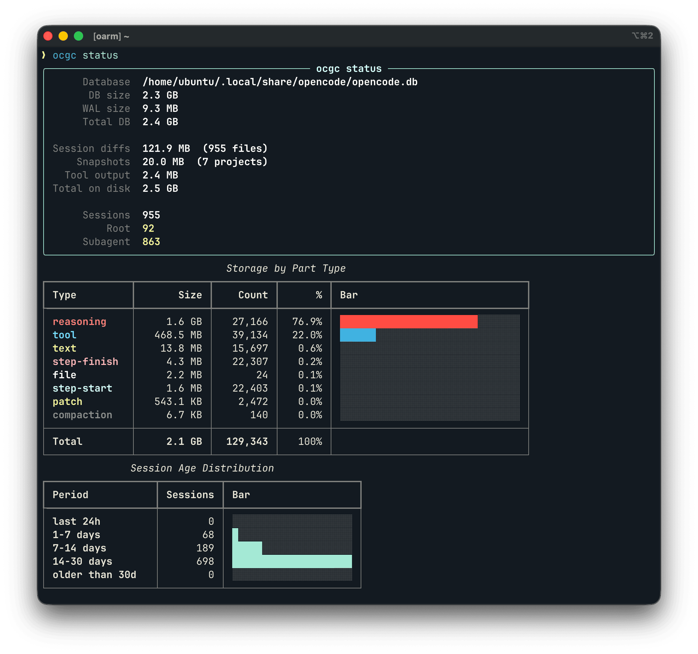
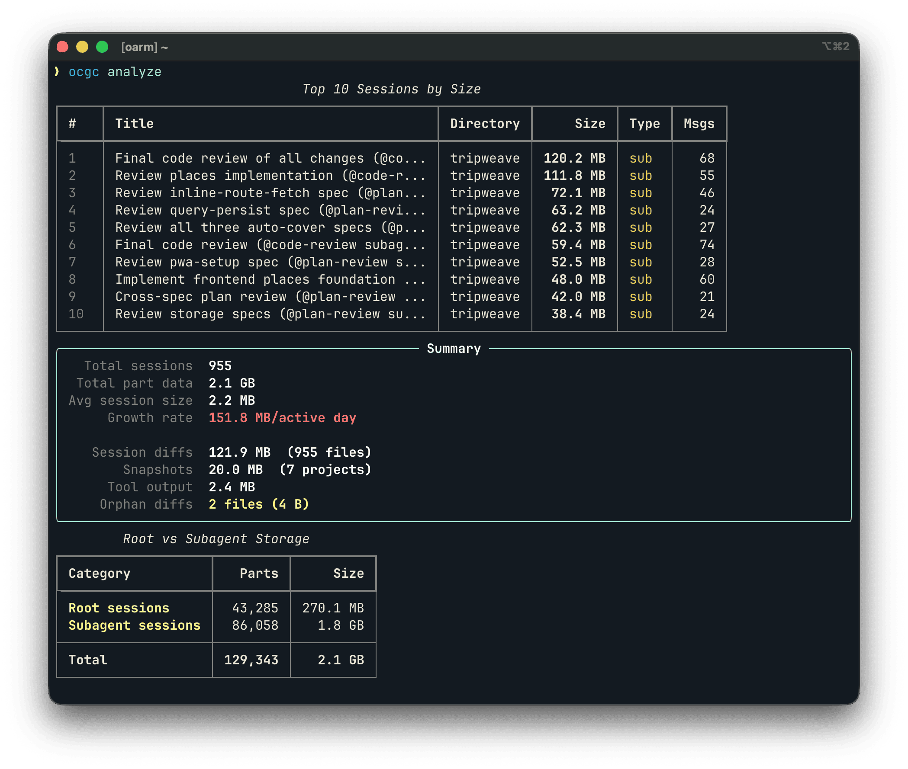
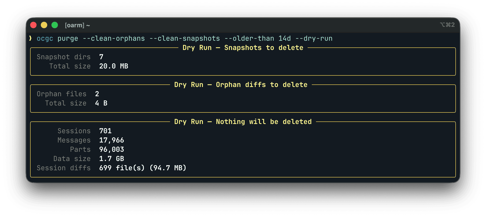

# ocgc: OpenCode Garbage Collector

Analyze and reclaim storage used by [OpenCode](https://github.com/anomalyco/opencode) sessions, diffs, and snapshots.

OpenCode stores sessions in a SQLite file that grows without limit and has [no built-in cleanup](https://github.com/anomalyco/opencode/issues/4980). It also writes session diffs and git snapshots to disk. `ocgc` shows where the space goes and reclaims it.

## Screenshots

`ocgc status`



`ocgc analyze`



`ocgc purge --clean-orphans --clean-snapshots --older-than 14d --dry-run`



## Quick start

Copy this to your AI agent:

```
Read https://raw.githubusercontent.com/whtsky/ocgc/refs/heads/main/README.md and help me garbage collect OpenCode storage.
```

## Install

```bash
uv tool install ocgc
```

Or with pip:

```bash
pip install ocgc
```

## Usage

```bash
# Dashboard: DB size, session breakdown, storage by part type
ocgc status

# List sessions sorted by size
ocgc sessions --sort size --limit 20

# Deep analysis: top sessions, growth rate, root vs subagent
ocgc analyze

# Preview what a purge would do
ocgc purge --older-than 14d --dry-run

# Delete subagent sessions older than a week
ocgc purge --subagents --older-than 7d

# Strip reasoning tokens only (biggest space win, ~77% of storage)
ocgc purge --strip-reasoning

# Other purge options
ocgc purge --larger-than 50M
ocgc purge --keep-latest 50
ocgc purge --session ses_abc123

# Clean up orphan session diff files (no matching session in DB)
ocgc purge --clean-orphans

# Delete all snapshot directories
ocgc purge --clean-snapshots

# Reclaim disk space after purging
ocgc vacuum
```

Multiple purge flags combine with AND. `--strip-reasoning` changes the action from deleting sessions to removing reasoning parts (from matching sessions, or all sessions if no other filters are given). `--clean-orphans` and `--clean-snapshots` run independently before any session purge. `--dry-run` previews without touching anything. `--force` skips the confirmation prompt.

## Filesystem storage

Beyond the SQLite database, OpenCode stores data on the filesystem:

- Session diffs (`~/.local/share/opencode/storage/session_diff/`): one JSON file per session containing full file contents. Cleaned automatically when sessions are purged.
- Snapshots (`~/.local/share/opencode/snapshot/`): git object packs for each project. Use `--clean-snapshots` to delete.
- Tool output (`~/.local/share/opencode/tool-output/`): small files from tool invocations. Shown in stats but no cleanup needed.

`ocgc status` and `ocgc analyze` show sizes for all three directories. `analyze` also reports orphan session diff files (files with no matching session in the DB).

## Safety

`status`, `sessions`, and `analyze` are read-only. `purge` asks for confirmation before deleting. `ocgc` warns if OpenCode is running.

## Custom database path

```bash
export OCGC_DB_PATH=/path/to/opencode.db
ocgc status
```

Default: `~/.local/share/opencode/opencode.db`

## License

MIT
